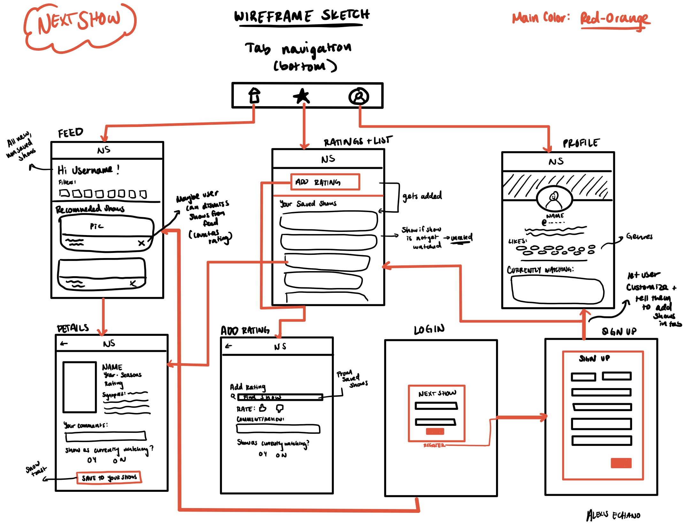
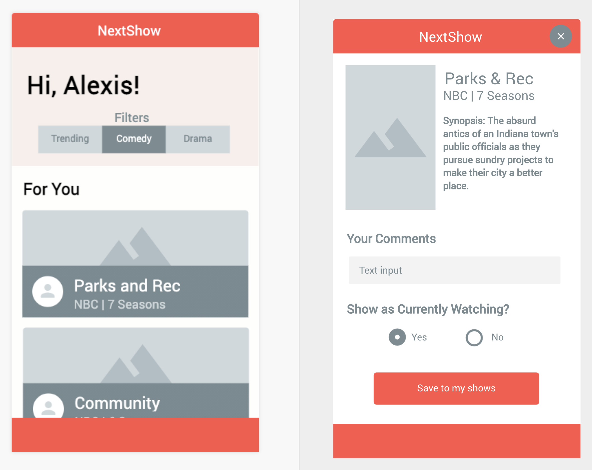

NEXT SHOW - Original App Design Project
===

## Table of Contents
1. [Overview](#Overview)
1. [Product Spec](#Product-Spec)
1. [Wireframes](#Wireframes)
2. [Schema](#Schema)

## Overview
### Description
A TV show recommender app that uses personal ratings and interests to aggregate a user's next binge!

### App Evaluation
[Evaluation of your app across the following attributes]
- **Category:** Entertainment, social
- **Mobile:** Mobile first experience
- **Story:** Allows users to find their next possibly-life changing TV show and share their review with others
- **Market:** Anyone who enjoys the entertainment industry and as streaming services increase in popularity and become more prevalent, this is a helpful application to aid in putting the watcher first and helps avoid the endless scrolling of shows on Netflix, Hulu, etc.
- **Habit:** After they finish a good show, they return to the app to find a new one OR help a friend/family find the new shot show. It is habit forming and as long as a person is interested in filling up their time with TV, the app keeps runnning!
- **Scope:** In a narrow focus, this app just has a news feed with search/ilter features and a user profile. The news feed will JUST show top tv shows and ones that are similar to the ones the user selects or rates. In the future, we can add sharing and more social-network-y features.

## Product Spec

### 1. User Stories (Required and Optional)

**Required Must-have Stories**

Outlined by FBU App Expectations and Priority
* **Your app has multiple views**
  *  User can view their profile, home timeline, and saved shows and ratings in separate views (P0)
  *  User can view TV show details from home timeline (P0)
* **Your app interacts with a database (e.g. Parse)**
  *  User can save rated shows and shows-to-watch (P1)
  *  User can view more than 10+ shows on home timeline through CardView and RecyclerView (P0)
  *  User can view TV show details like number of seasons and synopsis (P0)
  *  User ratings (like or dislike) are also saved within a database (P0)
* **You can log in/log out of your app as a user**
  * User lands on log-in screen and the app has user persistence (P0)
  * User can logout through profile page (P0)
* **You can sign up with a new user profile** 
  * User can register with new account (P0)
  * User can set up recommendations by choosing favorite genres and current fave shows (P2)
* **Your app integrates with at least one SDK (e.g. Google Maps SDK, Facebook SDK) or API (that you didn’t learn about in CodePath)**
  * User receives show recommendations on home timeline using [TasteDive](https://tastedive-api-documentation.readthedocs.io/en/latest/index.html) OR [IMDB](https://developers.themoviedb.org/3/tv/get-similar-tv-shows) OR [Trakt](https://trakt.docs.apiary.io/#reference/shows/recommended). (P0) 
* **Your app uses at least one gesture (e.g. double tap to like, e.g. pinch to scale) **
  * User can swipe to dismiss a show rec on home timeline which counts as a dislike rating (P2)
* **Your app uses at least one animation (e.g. fade in/out, e.g. animating a view growing and shrinking)**
  * In progress
* **Your app incorporates at least external library to add visual polish**
  * In progress (P2)
* **Your app provides opportunities for you to overcome difficult/ambiguous technical problems (more below)**
  * User can filter through TV shows based on Genre or if they are trending or not (P1)
  * Use combination of APIs to create own data model that has a recommendation system based on like/dislike ratings (P0)
  * App might need to do some background fetching and proper data handling to be able to show accurate, fast recommendations (P2)

**Optional Nice-to-have Stories**

* User can broadcast currently watching show on profile
* User has a nice UI experience with modern, clean design
* Add more complicated rating system like numerical rating out of 5.0
* Add season breakdown for show details and ability to rate per season
* User's news feed has friend's TV shows
* User ratings persist and are shown to friends's feeds
* User can customize profile and if they haven't watched shows, use movies as a starting point

### 2. Screen Archetypes

* Login Screen
   * User can sign-in and view their own profile
* Registration Screen
   * User can create new accountUser can sign-in and view their own profile
   * User can create profile with list of shows and favorite genres
* Timeline/Activity Feed
    * User can scroll through card-views of TV show recommendations
    * User can see top trending TV shows
    * User can search and filter through feed
    * User can swipe to dismiss show on feed (counts as a dislike)
* TV Show Detail Screen
    * User can view TV show details like season count, ratings, ranking
* Profile Screen
    * User can broadcast currently watching show
    * User can view their profile and fave genres
* Rating/Saved shows Screen
    * User can see a saved list of shows they've watched
    * User can add ratings/liked shows in separate view

### 3. Navigation

**Tab Navigation** (Tab to Screen)

* Home/Timeline
* Profile
* Ratings/Saved Shows

**Flow Navigation** (Screen to Screen)

* Home Activity Feed
   * TV Show details
* Profile
   * Broadcast current show to feed (like compose tweet and publish) -> optional story
* Login screen/registration
    * Home Timeline/Activity Feed if signin
    * Profile if register
* Rating/Saved shows
  * Can see TV Show Details page similar to if on feed
  * Separate rating activity

## Wireframes
[Add picture of your hand sketched wireframes in this section]

### [BONUS] Digital Wireframes & Mockups

### [BONUS] Interactive Prototype

## Schema 
[This section will be completed in Unit 9]
### Models
[Add table of models]
### Networking
- [Add list of network requests by screen ]
- [Create basic snippets for each Parse network request]
- [OPTIONAL: List endpoints if using existing API such as Yelp]
